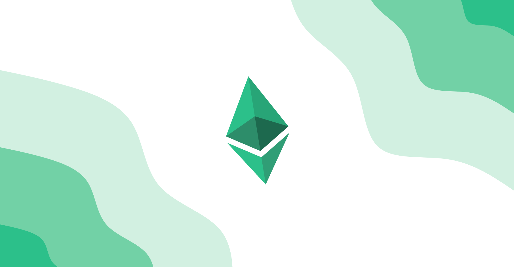

# Etherspay Wallet

## Downloads
You can find the latest version of Etherspay Wallet on our official website. For help using Etherspay Wallet, visit our User Support Site.

## Building locally

In the project directory, you can run:

### `yarn start`

Runs the app in the electron development mode.\
Open [http://localhost:3000](http://localhost:3000) to view it in your browser.

The page will reload when you make changes.\
You may also see any lint errors in the console.

### `yarn build`

Builds the React app for production to the `build` folder.\
It correctly bundles React in production mode and optimizes the build for the best performance.

The build is minified and the filenames include the hashes.\
Your app is ready to be deployed!

### `yarn dist`

Builds the Electron app using configuration specified in package.json. \
Outputs to `dist` folder by default.\

## Links
---